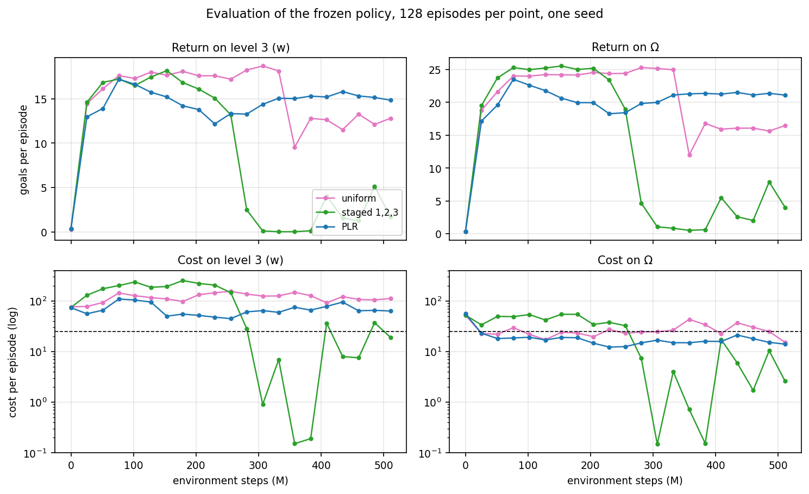
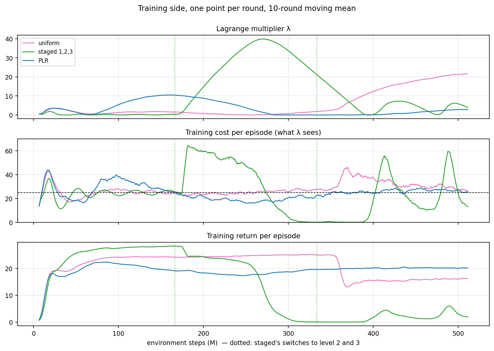
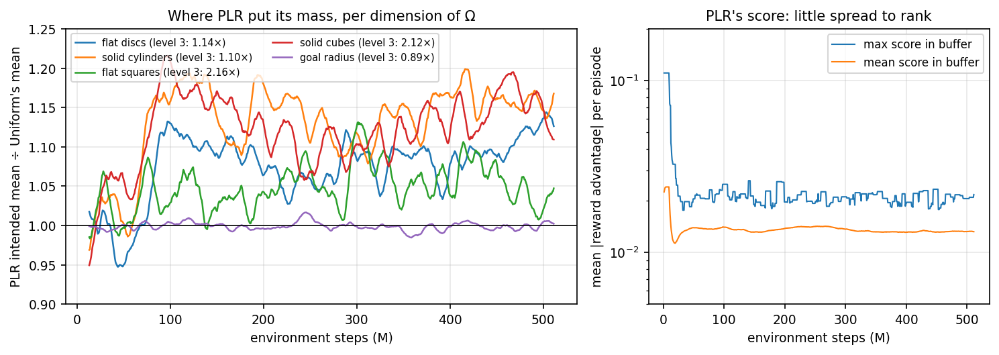

# Uniform vs staged vs PLR on `safe_goal_point`, 500 M steps

Done 2026-10-09. W&B group `goal_point_uniform_staged_plr_500M_v2`. One seed.
Plan items 1 and 3: the first automated curriculum against the two manual
baselines at the paper's budget, evaluated on the deployment task (level 3)
and on all of Ω.

## Question

Does PLR — a curriculum that needs no target, no mastery threshold and no
knowledge of what makes a context hard — reach level 3 at least as fast as
training uniformly over Ω, without the staged curriculum's failure (λ decays on
the easy stage and does not recover)? And where does PLR put its mass?

## Setup

PPO-Lagrange, `safe_goal_point` (one goal, fence, Ω = four active-hazard counts
with total ≤ 20 × goal radius ∈ [0.14, 0.22]; level 3 = (6, 4, 6, 4, 0.16)),
8192 envs, 1000-step episodes, budget 25, 763 rounds of 655 360 steps, 21
evaluations of 128 episodes on level 3 and on Uniform(Ω).

| arm | `--context_distribution` |
|---|---|
| uniform | `uniform` |
| staged | `staged:1,2,3`, switches at rounds 254 and 509 |
| PLR | `plr`: buffer 1000, score = whole-episode mean \|reward advantage\|, β = 1, ρ = 0.3, p = 0.5 |

```bash
COMMON="--env_name safe_goal_point --alg ppo_lag --seeds 0 \
  --num_envs 8192 --num_timesteps 500_000_000 --num_evals 21 --episode_length 1000 \
  --unroll_length 20 --batch_size 1024 --num_minibatches 32 --num_updates_per_batch 4 \
  --safety_bound 25 --deployment_distribution level:3 \
  --store_model false --skip_rollout --skip_video --measure_performance --quiet \
  --wandb_group goal_point_uniform_staged_plr_500M_v2"
for ARM in plr uniform staged:1,2,3; do .venv/bin/python -m training.train_env $COMMON --context_distribution $ARM; done
```

Mechanics: 0 recompiles, 86–89 k SPS on every arm; every evaluation episode
ran 1000 steps. Evaluation noise (sem over 128 episodes): level-3 cost ± 15,
level-3 return ± 0.5.

## Results

### The policy on the deployment task and on Ω



Mean of the last five evaluations (400–510 M):

| arm | level 3 return | level 3 cost | Ω return | Ω cost |
|---|---|---|---|---|
| uniform | 12.5 | 108 | 16.0 | 26 |
| staged | 2.7 | 22 | 4.4 | 8 |
| PLR | **15.3** | **73** | **21.3** | **17** |

- **PLR ends best on both targets**: highest return, lowest cost of the arms
  that still reach goals. It is under budget on Ω at 20 of 21 evaluations
  (uniform: 13). It is still 3× over budget on level 3; uniform is 4× over.
- **Staged's low cost is a motionless policy** (return 2.7, cost 22). A policy
  that does nothing satisfies any budget; that is not safety.
- **All three arms reach the same peak** (17–19 goals on level 3, 77–180 M).
  What differs is what happens after, and that is the training panel.

### Why: the Lagrange multiplier decides every end state



Training cost (middle panel, what λ regulates) sits on the budget line for
every arm that moves. The constraint is met on the training distribution $q$;
on level 3 it is 3–4× over for uniform and PLR alike, because their mean
context has 13.6 / 15.0 active hazards and level 3 has 20. *Training under $q$
enforces the budget under $q$* — the README's framing statement, a third time.

The multiplier (top panel) then does three different things:

- **Staged** — λ ≈ 0 for all of stage 1 (flat discs only; the policy learns to
  drive over them, return 28, the highest anywhere). At the switch to level 2,
  cost jumps 24 → 63 and λ climbs 0.3 → **40** over 150 rounds. The policy
  gives in at round 405–440 and is **motionless from round 470** (cost 0.9,
  return 0.2); the switch to level 3 at 509 lands on a policy that does nothing.
  This is the velocity-ant collapse of 2026-09-20 on a suite whose student
  *sees* its context: the "blind student" reading was not the cause; λ
  calibrated to the easy stage is sufficient.
- **Uniform** — λ cycles between 0 and 3.6 for 400 rounds, reaches 0 at round
  388, then climbs to **22 and is still rising at 500 M**. At round 546 the
  policy loses a third of its return (25 → 16 training, 18 → 12 on level 3)
  and does not recover. No switch, no curriculum: a pure integrator (gain 0.01
  on the per-step violation, no damping) overshooting.
- **PLR** — λ peaks at 10.5 around round 240 while PLR's mass moves to denser
  layouts, then decays to **0 for rounds 450–570 with cost under budget**, and
  ends at 2.9. Return 18–20 throughout; no collapse. PLR trains on a harder $q$,
  so it draws more λ early than uniform does, and that is what buys its lower
  cost on $w$; its cost signal is also less non-stationary (cumulative
  Σ(cost − 25) stays within ±800; uniform's reaches +2047), so the controller
  has less to overshoot on.

### Where PLR put its mass, and what it ranked by



Left: PLR's intended mean on every hazard count sits 6–14 % above Uniform's
from round 100 to the end, goal radius unchanged — a tilt towards level 3 on
every dimension, held for 680 rounds. The paper's emergent curriculum, in
direction; in size a tilt, not a concentration (`replay_mass/top_10` = 0.28,
the closed form for β = 1). Realised $\hat q$ equals $q$ to three decimals:
episodes are 999 steps for everyone, so exposure is uniform on this suite.

Right: the score PLR ranks by varies 1.6× between the best and the average
buffer row, and is flat over the run. The reward critic is about equally wrong
across Ω (`training/v_loss` ≈ 1e-4 throughout). Rank prioritisation is
scale-free, so the tilt happens anyway, but the signal it rides is weak — a
colder β would concentrate on noise. The *cost* landscape varies 4× across Ω.

## What this changes in the plan

1. **PPO-PID next.** Two of three end states are controller artefacts; no
   curriculum comparison on this suite is clean until λ is damped.
2. **PLR with the cost-critic score** after that: the reward critic has little
   to rank here, the cost critic has 4× to rank.
3. **β stays at 1.**
4. **Seeds**: one seed; the λ cycle's phase, and hence uniform's late collapse,
   will differ per seed.
